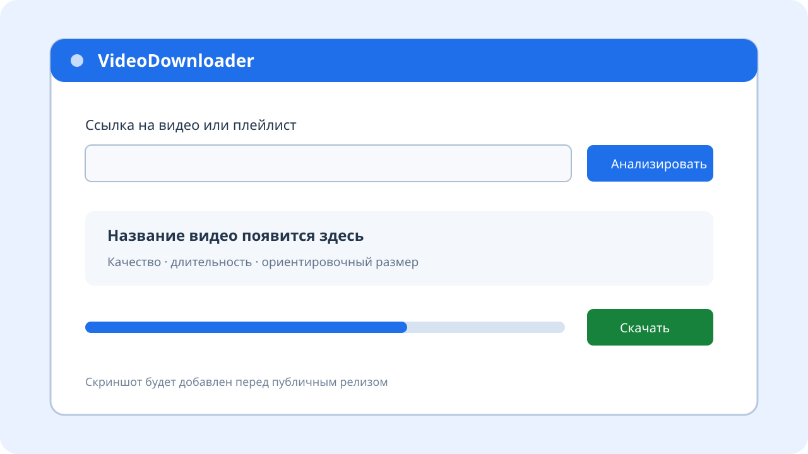

# VideoDownloader

VideoDownloader — настольное приложение для Windows с простым русскоязычным
интерфейсом к `yt-dlp`. Оно анализирует ссылки, скачивает одиночные видео и
плейлисты, а затем объединяет лучшие доступные видео- и аудиодорожки через
FFmpeg. Установленный Python, ручная настройка `PATH` и самостоятельная загрузка
внешних инструментов пользователю не нужны.



> Это место зарезервировано для скриншота первого публичного релиза.

## Возможности

- одиночные видео и плейлисты с сайтов, которые поддерживает `yt-dlp`;
- определение названия, длительности, доступных разрешений и ориентировочного
  размера после анализа ссылки;
- ограничения качества: Best, 2160p, 1440p, 1080p, 720p, 480p и 360p;
- контейнер MP4 или MKV и лучшее доступное аудио;
- диапазон элементов плейлиста, нумерация `001, 002, ...`, отдельная папка и
  download archive для пропуска уже скачанных записей;
- общий прогресс плейлиста, прогресс текущего файла, скорость, ETA и стадия
  постобработки;
- отмена вместе с дочерним деревом процессов и открытие папки результата;
- системная, светлая и тёмная темы;
- автоматическая подготовка проверенных `yt-dlp.exe`, `ffmpeg.exe` и
  `ffprobe.exe` при первом запуске;
- независимое обновление `yt-dlp` с подтверждением пользователя и откатом при
  ошибке.

Приложение не содержит собственных экстракторов сайтов: фактический список
поддерживаемых ресурсов и его изменения определяются используемой версией
`yt-dlp`. YouTube и другие публично доступные ресурсы работают в пределах
возможностей `yt-dlp`; отдельные сайты могут требовать авторизацию или менять
свои интерфейсы.

## Установка

1. Откройте раздел **Releases** будущего GitHub-репозитория.
2. Скачайте `VideoDownloaderSetup-0.1.0.exe` и запустите его.
3. После установки откройте VideoDownloader из меню «Пуск».
4. На первом запуске дождитесь подготовки внешних инструментов и проверки их
   контрольных сумм на отдельном экране.
5. Вставьте ссылку, нажмите «Анализировать», выберите параметры и скачайте файл.

Установка выполняется для текущего пользователя в
`%LOCALAPPDATA%\Programs\VideoDownloader` и не требует прав администратора.
Настройки, журнал и инструменты находятся отдельно, в
`%LOCALAPPDATA%\VideoDownloader`, поэтому обычное обновление приложения их не
удаляет и системный `PATH` не меняется.

### Переносной запуск

После локальной сборки можно перенести всю папку `dist\VideoDownloader` и
запускать `VideoDownloader.exe` без установки. Копировать только один `.exe`
нельзя: рядом находятся необходимые библиотеки Qt и Python. Пользовательские
данные всё равно сохраняются в `%LOCALAPPDATA%\VideoDownloader`.

## Разработка

Рекомендуется 64-битная Windows 10/11 и Python 3.12. В PowerShell:

```powershell
py -3.12 -m venv .venv
.\.venv\Scripts\python.exe -m pip install --upgrade pip
.\.venv\Scripts\python.exe -m pip install -e ".[dev,build]"
$env:PYTHONPATH = "$PWD\src"
.\.venv\Scripts\python.exe -m videodownloader.main
```

Проверки проекта:

```powershell
powershell.exe -NoProfile -ExecutionPolicy Bypass -File .\scripts\check.ps1
```

Интеграционные тесты внешних программ пропускаются по умолчанию. Их переменные
окружения описаны в [руководстве по выпуску](docs/release.md).

## Сборка Windows

Nuitka создаёт автономную папку приложения, Inno Setup — единый установщик:

```powershell
powershell.exe -NoProfile -ExecutionPolicy Bypass -File .\scripts\build.ps1 -Clean
powershell.exe -NoProfile -ExecutionPolicy Bypass -File .\scripts\build_installer.ps1
```

Результаты:

- `dist\VideoDownloader\VideoDownloader.exe` — переносная сборка;
- `installer\output\VideoDownloaderSetup-0.1.0.exe` — установщик;
- одноимённый `.sha256` — контрольная сумма установщика.

Подробная воспроизводимая процедура и требования к тегу версии находятся в
[docs/release.md](docs/release.md).

## Архитектура

Интерфейс не формирует shell-команды. Qt-контроллер создаёт типизированные
задания, слой загрузки превращает их в список аргументов и запускает отдельный
`yt-dlp.exe` без `shell=True`. Стандартные потоки читаются параллельно в фоновом
потоке, а структурированные progress templates преобразуются в события UI.
`ToolManager` отдельно отвечает за происхождение, SHA-256, установку и
обновление бинарников.

Подробнее: [архитектура](docs/architecture.md) и
[модель безопасности](docs/security.md).

## Приватность и ограничения

VideoDownloader не содержит телеметрии, рекламы и облачного сервера проекта.
URL передаётся выбранному сайту через `yt-dlp`; при подготовке и обновлении
инструментов приложение обращается к официальным страницам релизов GitHub и к
документированному поставщику Windows-сборки FFmpeg. Технические данные могут
записываться только в локальный журнал, причём URL в сообщениях маскируются.

Программа не обходит DRM, платные ограничения или защиту сайтов. Скачивайте
только материалы, на которые у вас есть права, и соблюдайте условия сервисов и
применимое авторское право. Авторы программы не отвечают за действия
пользователя и доступность сторонних сайтов.

## Лицензии

Собственный код VideoDownloader распространяется по лицензии [MIT](LICENSE).
Сборка использует PySide6/Qt, а во время работы отдельно загружает и запускает
`yt-dlp` и FFmpeg, у которых собственные условия. Детали и ссылки на исходный
код перечислены в [THIRD_PARTY_NOTICES.md](THIRD_PARTY_NOTICES.md) и
[docs/licensing.md](docs/licensing.md). Перед распространением производной
сборки её сопровождающий обязан самостоятельно проверить выполнение всех
условий сторонних лицензий.

## Участие в разработке

Ошибки и небольшие pull request приветствуются. Перед отправкой изменений
прочитайте [CONTRIBUTING.md](CONTRIBUTING.md), выполните проверки и не добавляйте
в Git внешние `.exe`, сборочные результаты, журналы или локальные настройки.
